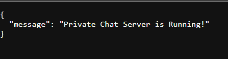

# 🗨️ Talkhub – Real-time Chat System

**Developer**: Jison Joseph Sebastian  
**Contact**: [Submit Suggestions or Queries](https://myporfolio-1o1h.onrender.com/contact)

---

## 📌 Project Overview

**Talkhub** is a full-stack chat application consisting of:

- **Client (Frontend + Logic Server)**: Built with **Django**, responsible for user authentication, rendering UI, managing chat logic, and storing messages in a MySQL database.
- **Server (Relay Server)**: Built with **Flask + Socket.IO**, handles real-time communication between users via private message events.

This project supports:
- Signup/login with unique UserID
- Real-time private chat via Socket.IO
- Online user indicators
- Chat history stored in MySQL
- Relay ID management and typing indicators *(in development)*

---

## 📁 Project Structure

```
Talkhub-Client/
├── accounts/              # Django app for user accounts and chat logic
│   ├── migrations/
│   ├── static/
│   ├── templates/
│   ├── admin.py
│   ├── apps.py
│   ├── forms.py
│   ├── models.py
│   ├── urls.py
│   ├── utils.py
│   └── views.py
├── staticfiles/
├── Talkhub/               # Django project config
│   ├── __init__.py
│   ├── asgi.py
│   ├── middleware.py
│   ├── settings.py
│   ├── urls.py
│   └── wsgi.py
├── manage.py

Talkhub-Server/
└── server.py              # Flask-Socket.IO relay server

Pics/
├── 1.png to 8.png         # Screenshots of the application
```

---

## ⚙️ How It Works

### ✅ Django Client

- Users register or login via a styled interface.
- Upon login, a **relay ID** is requested and stored.
- Users can chat with others in real-time.
- Messages are stored in a MySQL database.
- Chat history is loaded from the DB.
- Online users are shown with a status dot.

### 🔄 Flask Relay Server

- Hosts real-time communication over WebSocket.
- Listens for `private_message` events.
- Relays messages between users using their **relay IDs**.

---

## 🗃️ Database (MySQL)

**Tables**:
- `User`: Stores user details, hashed password, and custom 10-digit `userid`.
- `Online`: Keeps track of currently online users and their `relay_id`.
- `History`: Logs each message sent between users.

---

## 🌐 Server and URLs

In `Talkhub/settings.py`, connect to your servers and DB:

```python
# MySQL Database
#Replace your Database deatils here 
DATABASES = {
    'default': {
        'ENGINE': 'django.db.backends.mysql',
        'NAME': 'talkhub_db',
        'USER': 'your_mysql_user',
        'PASSWORD': 'your_password',
        'HOST': 'localhost',
        'PORT': '3306',
    }
}

# Flask Relay Server URL
RELAY_SERVER_URL = "your server url.com"
```

---

## 🖼️ Screenshots

Screenshots demonstrating the UI are available in the `Pics/` folder:
- `1.png` to `8.png`: Cover login, signup, dashboard, online status, chat UI, etc.

### Preview

|  |  |  |
|-----------------|-----------------|-----------------|
|  |  |  |
|  |  |                 |


## 🚀 How to Run

### 1. Start the Flask Relay Server
```bash
cd Talkhub-Server
python server.py
```

### 2. Run Django App
```bash
cd Talkhub-Client
python manage.py runserver
```

Visit `http://127.0.0.1:8000/` in your browser to use the app.

---

## 💡 Features in Progress
- Typing indicators
- Message read receipts
- Message syncing from relay → DB
